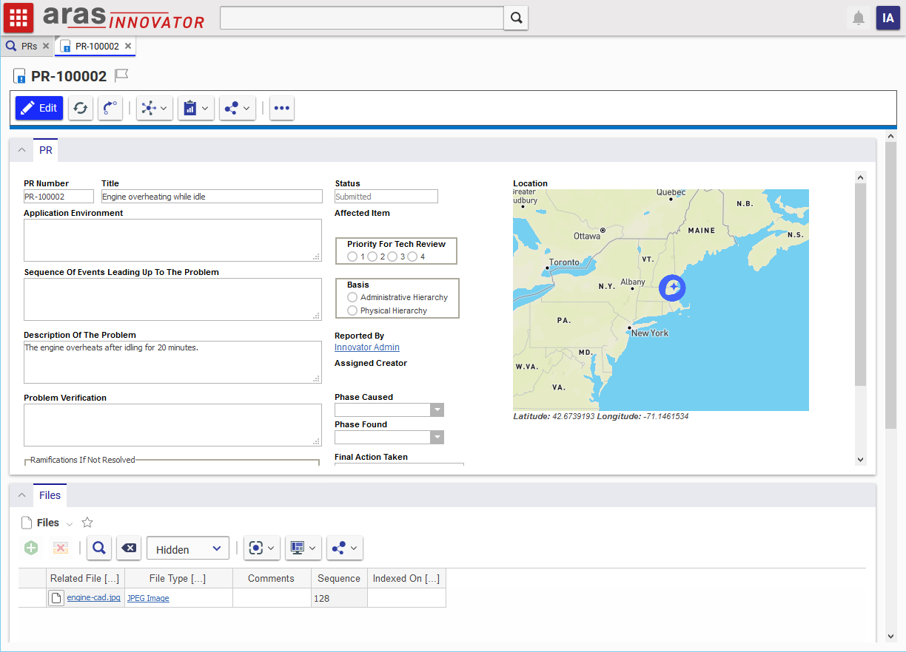
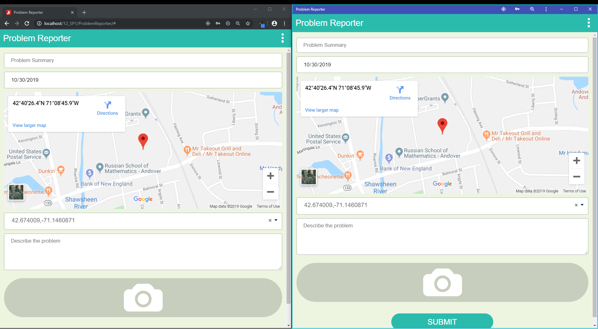
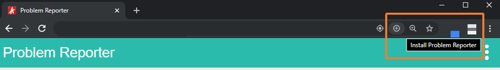
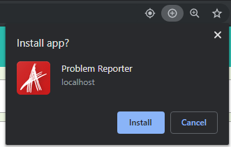
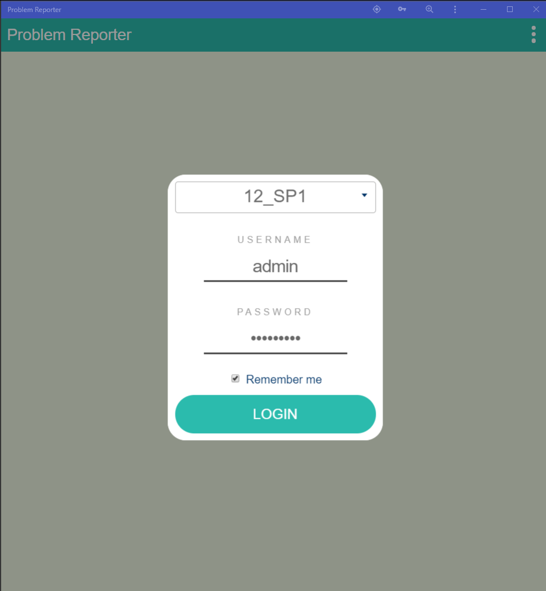
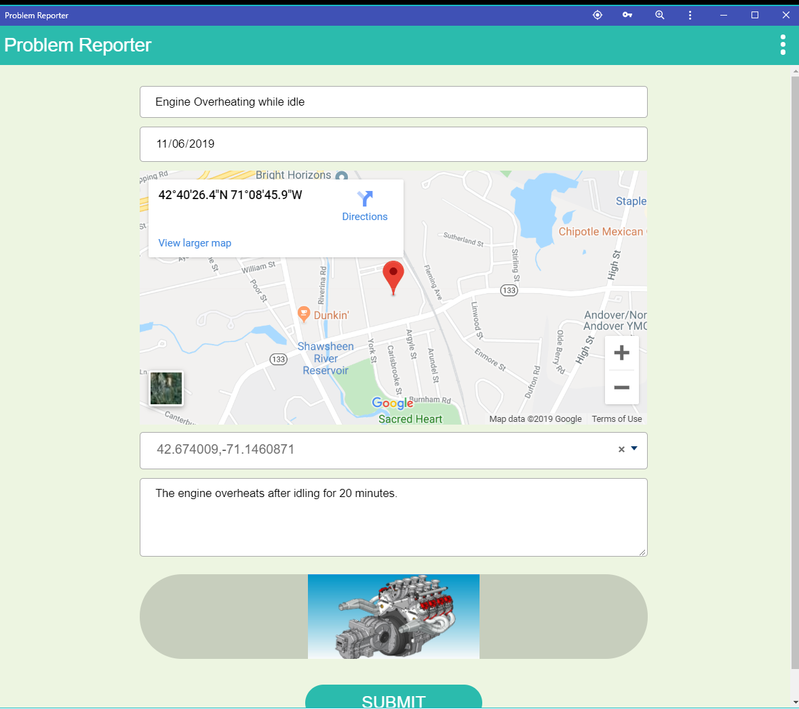

# PWA Sample App

This project contains a sample Progressive Web App (PWA) that connects to Aras Innovator via RESTful API and OAuth authentication. This task-specific application lets users file PRs in Innovator via a mobile-friendly GUI, including camera and image upload features. 


## Project Details


## Installation

#### Important!
**Always back up your code tree and database before applying an import package or code tree patch!**

### Pre-requisites

1. Aras Innovator installed (version 12.0+)
2. Aras Package Import Utility - *optional*
3. PWA-sample-app import package - *optional*
4. Code Tree overlay - *optional*

>Note: Progressive Web Apps require HTTPS to be enabled to take full advantage of certain native controls, like location services. You can use this application with an Innovator instance that doesn't have HTTPS enabled, but some PWA features might not work as expected.

### Configure IIS
1. Download or clone the pwa-sample-app to the Innovator server. 
2. Open the IIS manager on the server. 
3. Expand the tree in the connection pane down to the web application for your Innovator instance: **{server} > Sites > Default Web Site > {web alias}** <!-- TODO: Add screenshot -->
4. Right click on the web application for your Innovator instance (label matches your web alias) and select **Add application**.
5. In the Add Application dialog, enter "ProblemReporter" in the **Alias** field. This will be the name of the application in the url.
6. In the **Physical path** field, select the location of the downloaded pwa-sample-app project. 
7. Click **Ok** to close the Add Application dialog. 
8. Restart IIS.

### Configure the Client Registry
1. On the server, navigate to `{install_path}\OAuthServer\OAuth.config` where `{install_path}` is the path to your Aras Innovator installation. 
    * The default path suggested by the Aras Innovator installer is `C:\Program Files (x86)\Aras\Innovator`.
2. Find `<clientRegistries>` tag in the config file and put following configuration inside this section:
    ``` xml
    <clientRegistry id="ProblemReporter" enabled="true">
        <allowedScopes>
            <scope name="Innovator"></scope>
            <scope name="offline_access"></scope>
        </allowedScopes>
        <allowedGrantTypes>
            <grantType name="password"></grantType>
        </allowedGrantTypes>
        <tokenLifetime accessTokenLifetime="3600" authorizationCodeLifetime="300" refreshTokenSlidingLifetime="36000" refreshTokenOneTimeOnly="true" refreshTokenAbsoluteExpiration="false"></tokenLifetime>
    </clientRegistry>
    ```
3. Save and close the OAuth.config file.

### Optional: Install the Location Feature
One of the many advantages of PWAs is that they provide access to device services and APIs that are usually limited to native applications. To demonstrate how you can use location services, we've implemented a feature that lets users incluse a location with their problem report in the PWA and view the location in a map on the PR form in Aras. 



This feature is optional. The PWA will still work if you skip these setup steps - you just won't see the location map in your Aras PR form.

#### Code Tree
1. Backup your code tree and store the backup in a safe place.
2. Copy the `/Innovator/` folder in your local repository.
3. Paste this folder to the root of your code tree.
    * This should be the same folder that contains the `InnovatorServerConfig.xml` file.

#### Database
1. Backup your database and store the BAK file in a safe place.
2. Open up the Aras Package Import tool
3. Enter your login credentials and click Login
    * _Note: You must login as root for the package import to succeed!_
4. Enter the package name in the TargetRelease field
5. Enter the path to your local ..\pwa-sample-app\Import\imports.mf file in the Manifest File field
6. Select **ProblemReporter** and **com.aras.innovator.solution.PLM** in the Available for Import field
7. Select Type = Merge and Mode = Thorough Mode
8. Click Import in the top left corner
9. Close the Aras Package Import tool

#### Mapbox API Key
We used a JavaScript library called [Mapbox](https://www.mapbox.com/) to display the location data as a map on the Aras PR form. To use this feature, you'll need to sign up for a Mapbox account and request an API key. Mapbox is a paid service, however they include a generous free tier and they don't require your billing information to start using the service. 

1. [Sign up for a free Mapbox account.](https://account.mapbox.com/auth/signup/)
2. Once you're signed up, go to your [account page](https://account.mapbox.com/). Scroll down to the Access Tokens section and copy your token.
3. Login to Innovator as admin.
4. Navigate to **Administration > Variables** in the TOC.
5. Open the labs_MapToken Variable and paste your token in the value field.
6. Save and close the labs_MapToken item.

>If you don't want to use Mapbox, you can use our implementation as an example of how to implement the location/map service of your choice. Just update the HTML in the "map" field on the PR form and edit the labs_LoadLocationMap Method with the logic for your preferred library. 

### Optional: Install the PWA on Your Device
One of the neat benefits of using a PWA is that you can "install" the app on your device, providing an experience similar to a native application. Once the app is installed on your device you can view the PWA in its own window and pin it to your desktop or taskbar.


*Side by side comparison of the Problem Reporter app running in a browser (left) vs. running as an installed app (right).*

>Different platforms and browsers have adopted PWA features at different rates. Some are more comprehensive than others. Your device or browser may not support this feature.

Here's how you install a PWA on a Windows device using Google Chrome.

1. In your browser, enter the url for the Problem Reporter app.
2. In the address bar, you should see an option to install the Problem Reporter app. The action is also accessible in the main menu on the right.
    
3. Once you've clicked the install action, Chrome will ask you to confirm that you want to install the app.
    
4. After you confirm that you want to install the app, the PWA will open in a new window.


## Usage

1. In your browser, enter the url for the Problem Reporter app. This should be your Innovator url, plus the string we configured in step 5 above: `https://{server}/{Innovator alias}/ProblemReporter`
2. Login to the problem reporter app using your Innovator credentials. You can check off "Remember me" if you'd like to cache your credentials.

    

3. On the problem report form, enter the name and description for your problem. 
4. If you would like to submit an image with your PR, click the camera icon to select an image file or take a new photo, depending on your device and browser support.

    

5. Click the **Submit Problem Report** button to send the report to Innovator and create a new PR item.
6. To view the problem report in Innovator, login to your Innovator instance and search for the PR under **Change Management > PRs** in the TOC.

    


## Contributing

1. Fork it!
2. Create your feature branch: `git checkout -b my-new-feature`
3. Commit your changes: `git commit -am 'Add some feature'`
4. Push to the branch: `git push origin my-new-feature`
5. Submit a pull request

For more information on contributing to this project, another Aras Labs project, or any Aras Community project, shoot us an email at araslabs@aras.com.


## Credits

Created by Andrew Johnson, Chris Gillis, Eli Donahue, and Ivan Bidolakh for Aras Labs.

Updated by Nithin Mahesh for Aras Labs. 

## License

Aras Labs projects are published to Github under the MIT license. See the [LICENSE file](./LICENSE.md) for license rights and limitations.