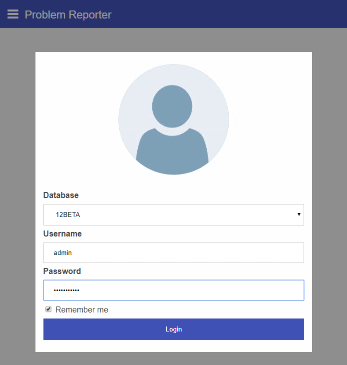
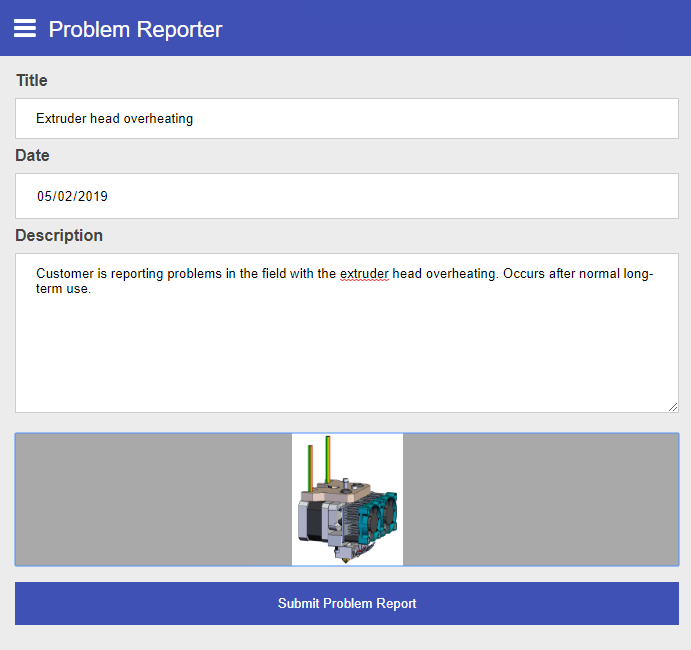

# PWA Sample App

This project contains a sample Progressive Web App (PWA) that connects to Aras Innovator via RESTful API and OAuth authentication. This task-specific application lets users file PRs in Innovator via a mobile-friendly GUI, including camera and image upload features. 

## Project Details

## Installation

#### Important!
**Always back up your code tree and database before applying an import package or code tree patch!**

### Pre-requisites

1. Aras Innovator installed (version 11.0 SP15)

>Note: Progressive Web Apps require HTTPS to be enabled to take full advantage of certain native controls, like location services. You can use this application with an Innovator instance that doesn't have HTTPS enabled, but some PWA features might not work as expected.

### Install Steps

1. Download or clone the pwa-sample-app to the Innovator server. 
2. Open the IIS manager on the server.
3. Expand the tree in the connection pane down to the web application for your Innovator instance: **{server} > Sites > Default Web Site > {web alias}**
4. Right click on the web application for your Innovator instance (label matches your web alias) and select **Add application**.
5. In the Add Application dialog, enter "ProblemReporter" in the **Alias** field. This will be the name of the application in the url.
6. In the **Physical path** field, select the location of the downloaded pwa-sample-app project. 
7. Click **Ok** to close the Add Application dialog. 
8. Restart IIS.

This application does not require any imports to the Innovator database.

## Usage

1. In your browser, enter the url for the Problem Reporter app. This should be your Innovator url, plus the string we configured in step 5 above: `https://{server}/{Innovator alias}/ProblemReporter`
2. Login to the problem reporter app using your Innovator credentials. You can check off "Remember me" if you'd like to cache your credentials.

    

3. On the problem report form, enter the name and description for your problem. 
4. If you would like to submit an image with your PR, click the camera icon to select an image file or take a new photo, depending on your device and browser support.

    

5. Click the **Submit Problem Report** button to send the report to Innovator and create a new PR item.

## Contributing

1. Fork it!
2. Create your feature branch: `git checkout -b my-new-feature`
3. Commit your changes: `git commit -am 'Add some feature'`
4. Push to the branch: `git push origin my-new-feature`
5. Submit a pull request

For more information on contributing to this project, another Aras Labs project, or any Aras Community project, shoot us an email at araslabs@aras.com.

## Credits

Created by Andrew Johnson, Chris Gillis, and Eli Donahue for Aras Labs.

## License

Aras Labs projects are published to Github under the MIT license. See the [LICENSE file](./LICENSE.md) for license rights and limitations.